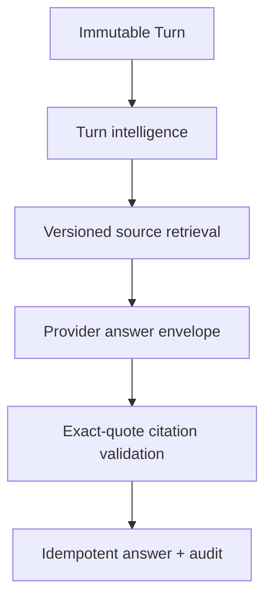
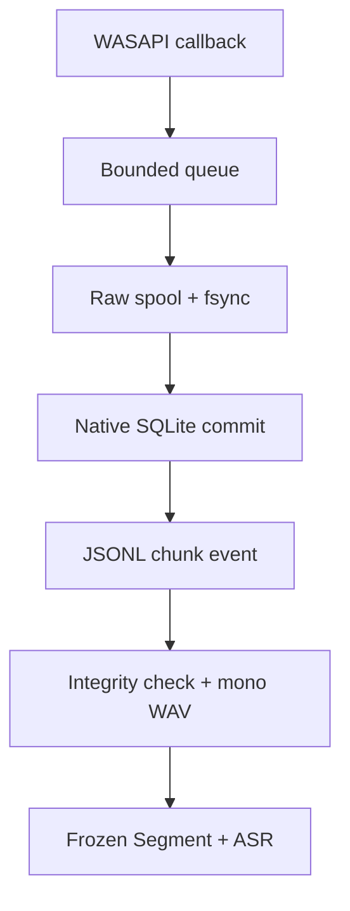

# Auralis architecture — v0.14.1 Intelligence Layer

## Architectural decision

Auralis remains a modular monolith. Raw audio is the authority; transcripts, Turn intelligence, retrieval runs, citations, and answers are derived, revisioned records. The Intelligence Layer extends the existing capture-first pipeline and does not take ownership of audio persistence.

## Source-of-truth boundaries

1. `native/core` owns Windows capture, loss accounting, raw spool durability, the native ledger, and post-commit JSONL product events. It never calls ASR or the UI from the WASAPI callback.
2. `core` owns portable deterministic domain logic: Persian routing, Turn intelligence, document chunking, query planning/reranking, answer-envelope parsing, and citation integrity.
3. `runtime` owns process configuration, local HTTP trust boundaries, bounded request parsing, static-path resolution, and task supervision.
4. `server.mjs` is the Bun composition root and application workflow layer. It accepts only session-bound JSONL events from the packaged v0.14 product bridge, verifies raw-chunk integrity, derives mono PCM16 WAV files, persists immutable Segments, and wires ASR/Brain adapters. Deterministic domain rules stay in `core`.
5. `packages/contracts` is the TypeScript contract boundary. `apps/web/src` consumes it through immutable reducers.
6. `apps/web/public` is the offline browser UI and preserves the focused workspace layout.

## Dependency direction

```text
apps/web -> packages/contracts
server.mjs -> runtime + core
runtime -> Node/Bun platform APIs
native/core adapters -> native/core domain ports
core -> no server, browser, SQLite, or provider dependency
```

## Intelligence data flow



- Every committed Turn receives one persisted intelligence record.
- Continuations resolve only to a previous answerable Turn; unresolved references are marked ambiguous.
- Retrieval runs persist the normalized plan, candidate count, ordered hits, scores, matched terms, and excerpts.
- Only `ACTIVE` source versions participate in retrieval. Superseded/deleted rows remain for lineage and historical foreign keys.
- Source/mixed answers without a verified exact quote are downgraded to `grounding_unverified`.

## Product audio bridge



- Process spawn is not readiness. The product enters `CAPTURING` only after every requested channel emits a valid, session-bound `capture.channel_started` event.
- A chunk becomes visible to the product only after the native raw file and ledger commit are durable.
- Raw length and SHA-256 are revalidated before a derived WAV or Segment is created.
- v0.14.1 deliberately uses durable fixed windows for product transcription. It does not claim neural speech-boundary VAD; that remains an explicit future optimization.

## Security and durability

The server binds to loopback, validates Host/Origin/Fetch Metadata, and requires a constant-time per-process token for state changes. JSON is UTF-8/object-only/bounded. Source uploads are bounded to 8 MB, accepted from an explicit text MIME allowlist, sanitized metadata, hashed, and transactionally indexed. Background ASR/answer tasks remain supervised and capture continues independently from provider failure.

## Schema ownership

- Application schema: 9 (`turn_intelligence`, `retrieval_runs`, `retrieval_hits`, `citation_audits`, versioned source columns).
- Native schema: migration 6 (speech stream reliability contracts).
- The native and application ledgers remain separate persistence contexts.

## Release gates

- Full Node regression suite and v0.14 intelligence tests.
- Citation benchmark: precision 1.00 and quote coverage 1.00 on committed Persian/adversarial fixtures.
- Retrieval benchmark: expected relevant chunk ranked first.
- TypeScript strict type-check and deterministic web build.
- Cross-manifest version parity.
- Inherited Rust format/Clippy/unit gates and Windows microphone/loopback/hardware soak gates.
